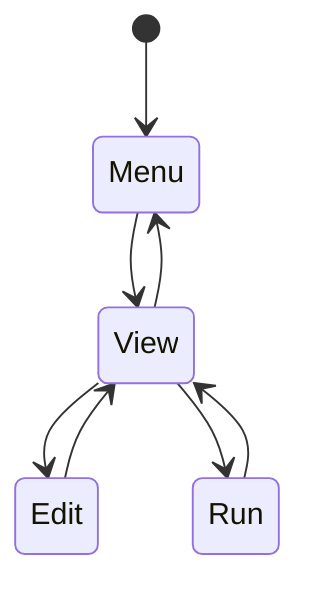

# Front-End Architecture
## Operating Modes
There are four operating modes that describe the current state of Hogism's front-end.
### Menu
At the beginning of program execution, Hogism enters menu mode.
In menu mode, the user can either choose to load a saved workspace or start a new workspace.
* Can only select either to begin new workspace or load one from a file
### View
In view mode, the user can freely move the view window around the workspace without risk of accidently modifying the current workspace state.
* Cannot modify workspace state
* Outputs of circuits are unknown
* Circuit is represented both as matrix and graph representation
* Circuit must be valid
### Edit
In edit mode, the user can freely modify circuits and their input values in the workspace.
Like in view mode, all outputs are unknown.
* Can modify workspace state
* Outputs of circuits are unknown
* Circuit is represented solely as matrix representation
* Circuit can be invalid
### Run
In run mode, the circuit has been run and output values have been decided.
* Cannot modify workspace state
* Outputs of circuits are known
* Graph representation is used to determine outputs
* Circuit must be valid
### Mode State Machine


## Visual Representation
All logic gates are represented visually using a combination of traditional ASCII characters and modern unicode characters.
The standard unit is an cell with a 1 character height and a 3 character width.
All unary gates (i.e. buffer and an inverter) require only one cell.
All multiple-input gates require at least three vertical cells and can only take up an odd number of cells.
A full description of valid cells is listed in Appendix A.

## Appendix A
### Low Source (LOW_SRC)
#### Normal
```
(0)
```
#### ASCII Only
```
(0)
```
### High Source (HIGH_SRC)
#### Normal
```
(1)
```
#### ASCII Only
```
(1)
```
### Unknown Output (UNK_OUT)
#### Normal
```
(?)
```
#### ASCII Only
```
(?)
```
### Low Output (LOW_OUT)
#### Normal
```
(0)
```
#### ASCII Only
```
(0)
```
### High Output (HIGH_OUT)
#### Normal
```
(1)
```
#### ASCII Only
```
(1)
```
### LR or RL Path w/o Cross
#### Normal
```
───
```
#### ASCII Only
```
---
```
### HL or LH Path w/o Cross
#### Normal
```
 │ 
```
#### ASCII Only
```
 | 
```
### Path w/ Cross
#### Normal
```
─│─
```
#### ASCII Only
```
-|-
```
### Path w/ Intersection
#### Normal
```
─┼─
```
#### ASCII Only
```
-+-
```
## HL or LH Path to Right Path
#### Normal
```
 ├─
```
#### ASCII Only
## HL or LH Path to Left Path
#### Normal
```
─┤ 
```
#### ASCII Only
## RL or LR Path to LH Path
#### Normal
```
─┴─
```
#### ASCII Only
## RL or LR Path to HL Path
#### Normal
```
─┬─
```
#### ASCII Only
### LR to HL or LH to RL Path
#### Normal
```
─┐ 
```
#### ASCII Only
```
-\ 
```
### LR to LH or HL to RL Path
#### Normal
```
─┘ 
```
#### ASCII Only
```
-/ 
```
### RL to HL or LH to LR Path
#### Normal
```
 ┌─
```
#### ASCII Only
```
 /- 
```
### RL to LH or HL to LR Path
#### Normal
```
 └─
```
#### ASCII Only
```
 \- 
```
### LR or RL Buffer
#### Normal
```
┤=┠
┨=├
```
#### ASCII Only
```
|=|
```
### LR or RL Inverter
#### Normal
```
┤¬┠
┨¬├
```
#### ASCII Only
```
|~|
```
### LR OR Input
#### Normal
```
┤⋁│
```
#### ASCII Only
```
|OR
```
### LR OR Output
#### Normal
```
│⋁┠
```
#### ASCII Only
```
|OR
```
### LR OR Body
#### Normal
```
│⋁│
```
#### ASCII Only
```
|OR
```
### RL OR Input
#### Normal
```
│⋁├
```
#### ASCII Only
```
OR|
```
### RL OR Output
#### Normal
```
┨⋁│
```
#### ASCII Only
```
OR|
```
### RL OR Body
#### Normal
```
│⋁│
```
#### ASCII Only
```
OR|
```
### LR AND Input
#### Normal
```
┤⋀│
```
#### ASCII Only
```
|&&
```
### LR AND Output
#### Normal
```
│⋀┠
```
#### ASCII Only
```
|&&
```
### LR AND Body
#### Normal
```
│⋀│
```
#### ASCII Only
```
|&&
```
### RL AND Input
#### Normal
```
│⋀├
```
#### ASCII Only
```
&&|
```
### RL AND Output
#### Normal
```
┨⋀│
```
#### ASCII Only
```
&&|
```
### RL AND Body
#### Normal
```
│⋀│
```
#### ASCII Only
```
&&|
```
### LR XOR Input
#### Normal
```
┤⊻│
```
#### ASCII Only
```
|^^
```
### LR XOR Output
#### Normal
```
│⊻┠
```
#### ASCII Only
```
|^^
```
### LR XOR Body
#### Normal
```
│⊻│
```
#### ASCII Only
```
|^^
```
### RL XOR Input
#### Normal
```
│⊻├
```
#### ASCII Only
```
^^|
```
### RL XOR Output
#### Normal
```
┨⊻│
```
#### ASCII Only
```
^^|
```
### RL XOR Body
#### Normal
```
│⊻│
```
#### ASCII Only
```
^^|
```
### LR NOR Input
#### Normal
```
┤⊽│
```
#### ASCII Only
```
|R~
```
### LR NOR Output
#### Normal
```
│⊽┠
```
#### ASCII Only
```
|R~
```
### LR NOR Body
#### Normal
```
│⊽│
```
#### ASCII Only
```
|R~
```
### RL NOR Input
#### Normal
```
│⊽├
```
#### ASCII Only
```
~R|
```
### RL NOR Output
#### Normal
```
┨⊽│
```
#### ASCII Only
```
~R|
```
### RL NOR Body
#### Normal
```
│⊽│
```
#### ASCII Only
```
~R|
```
### LR NAND Input
#### Normal
```
┤⊼│
```
#### ASCII Only
```
|&~
```
### LR NAND Output
#### Normal
```
│⊼┠
```
#### ASCII Only
```
|&~
```
### LR NAND Body
#### Normal
```
│⊼│
```
#### ASCII Only
```
|&~
```
### RL NAND Input
#### Normal
```
│⊼├
```
#### ASCII Only
```
~&|
```
### RL NAND Output
#### Normal
```
┨⊼│
```
#### ASCII Only
```
~&|
```
### RL NAND Body
#### Normal
```
│⊼│
```
#### ASCII Only
```
~&|
```
### LR XNOR Input
#### Normal
```
┤↔│
```
#### ASCII Only
```
|^~
```
### LR XNOR Output
#### Normal
```
│↔┠
```
#### ASCII Only
```
|^~
```
### LR XNOR Body
#### Normal
```
│↔│
```
#### ASCII Only
```
|^~
```
### RL XNOR Input
#### Normal
```
│↔├
```
#### ASCII Only
```
~^|
```
### RL XNOR Output
#### Normal
```
┨↔│
```
#### ASCII Only
```
~^|
```
### RL XNOR Body
#### Normal
```
│↔│
```
#### ASCII Only
```
~^|
```
